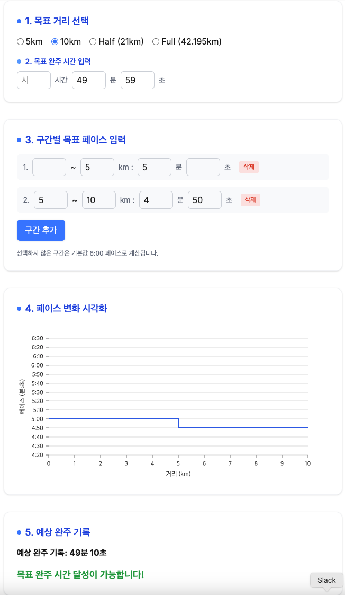

# 러닝 페이스 계산기

구간별로 러닝 페이스를 입력하면 예상 완주 기록과 페이스 변화 그래프를 시각적으로 보여주는 웹앱입니다.

## 주요 기능

- 5km, 10km, 하프(21km), 풀(42.195km) 등 목표 거리 선택
- 구간별로 km당 페이스(분/초) 입력 (구간 추가/삭제 가능)
- 입력한 구간별 페이스로 전체 완주 기록(시:분:초) 자동 계산
- 페이스 변화 그래프를 Nivo Line Chart로 시각화
- 반응형 UI, 직관적이고 깔끔한 디자인

## 사용법

1. 목표 거리를 선택합니다.
2. 구간별로 km 범위와 페이스(분/초)를 입력합니다.
   - 구간을 추가/삭제할 수 있습니다.
   - 입력하지 않은 구간은 기본값(6:00/km)으로 계산됩니다.
3. 예상 완주 기록과 페이스 변화 그래프를 확인합니다.

## 기술 스택

- Next.js (App Router, TypeScript)
- Tailwind CSS
- @nivo/line (데이터 시각화)

문의/기여 환영합니다!
